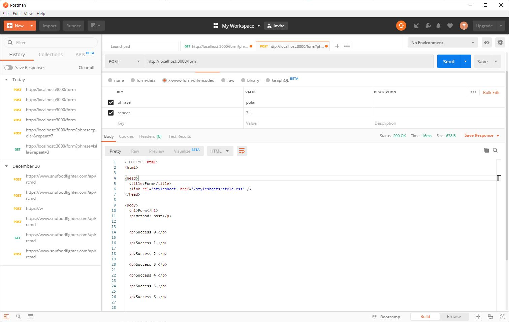
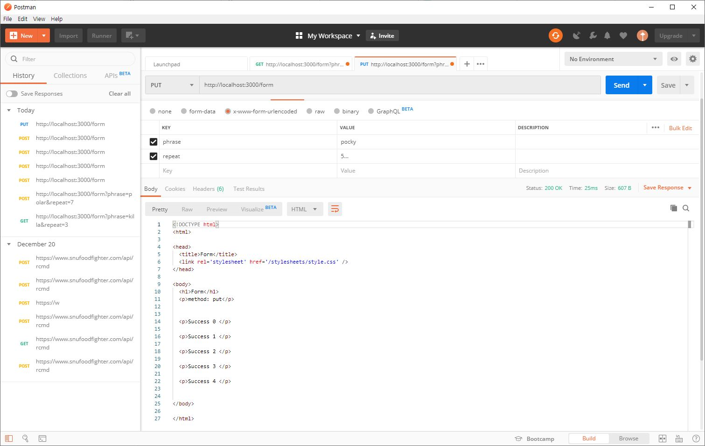
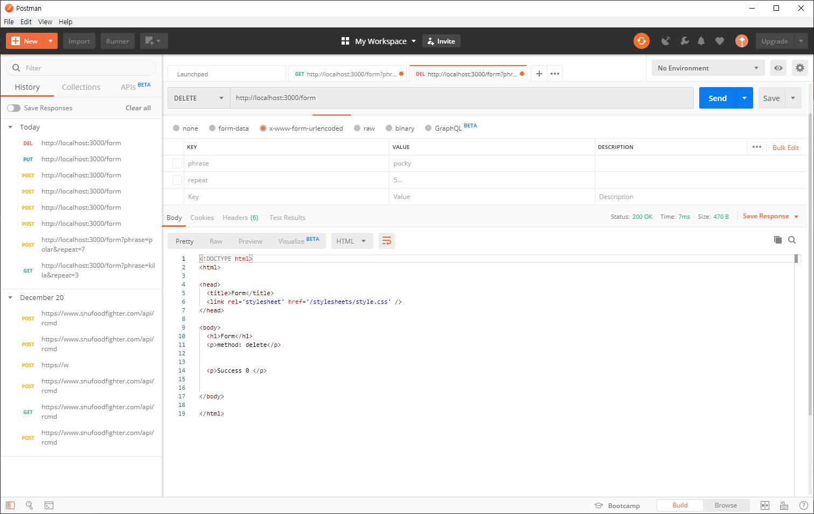

### 12월 23일
* todo list의 제목을 "HelloTODO"로 하기 위해서는 localhost:3000/todo?title=HelloTODO 로 접근해야 함


### 12월 24일
* Get method
 
* Push method
 
* Put method
 
* Delete method
 


 ### 12월 25일
* undefined
 
* text/plain
 
* text/plain Waas
   
* text/html
 
* json
 

 ### 12월 27일 
* screenshot
    ```
    waas/team으로 생성되는 쿠키와 동일하게 namkim/il로 쿠키를 생성되게 만들고, waas가 아닌 아이디로 로그인했을 경우에 403 forbidden이 뜨게하기 위해서 /isLogint 에서 쿠키의 name이 namkim으로 로그인되었을 때 403 forbidden이 뜨게 변경했다.
    ```
 

